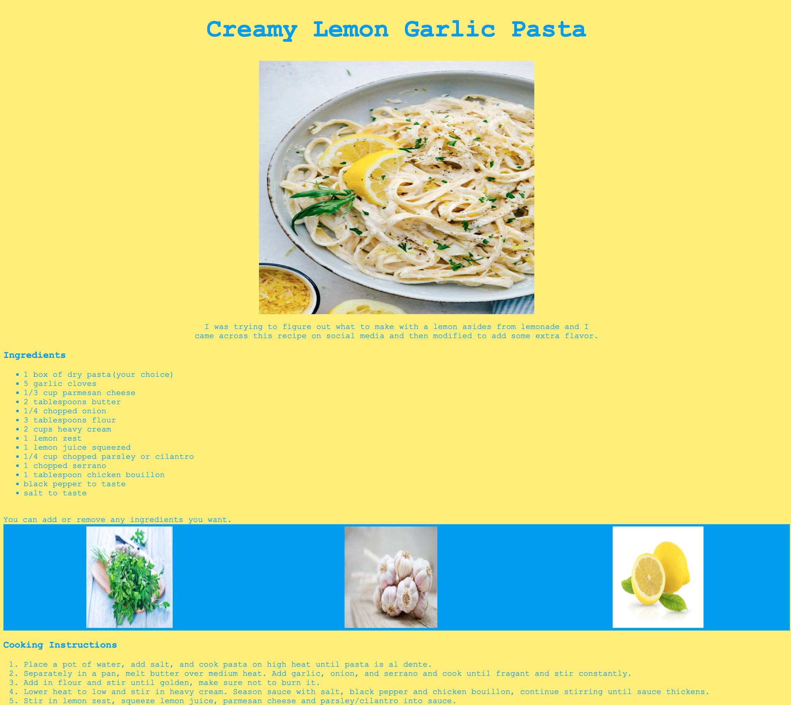

# Recipe Page

 Create a webpage featuring one of your favorite recipes. It should display the ingredients, step-by-step instructions, links to similar recipes, and at least one photo. Utilize HTML for structuring the webpage, CSS for styling and layout, and JavaScript DOM to incorporate interactive elements.



## Installation
To get started with the project, follow these steps:
<br/>

1. Clone the repository to your local machine using the following command:
```
git clone git@github.com:xocaid/techtonica-assignments.git
```
2. Navigate to the project directory:
```
cd Week2_RecipePage
```
3. Locate the recipePg.html file within the project.

4. Right-click on the `recipePg.html` file  on the Explorer tab and select <i>Open with Live Server</i> from the context menu.
The project will open in your default web browser, allowing you to interact with the live version.

## Future Development
- Redesign the User Interface to be have a cookbook-style layout.
- Allow users to adjust the serving size for recipes to fit their specific needs.
- Toggle between units of measurement such as ounces, grams, cups, etc.
- Introduce a comment and rating system for each recipe, allowing users to share their experiences and suggestions.

## Note
Ensure that you have "Live Server" installed on VS Code. If not, download and install it from Extensions.