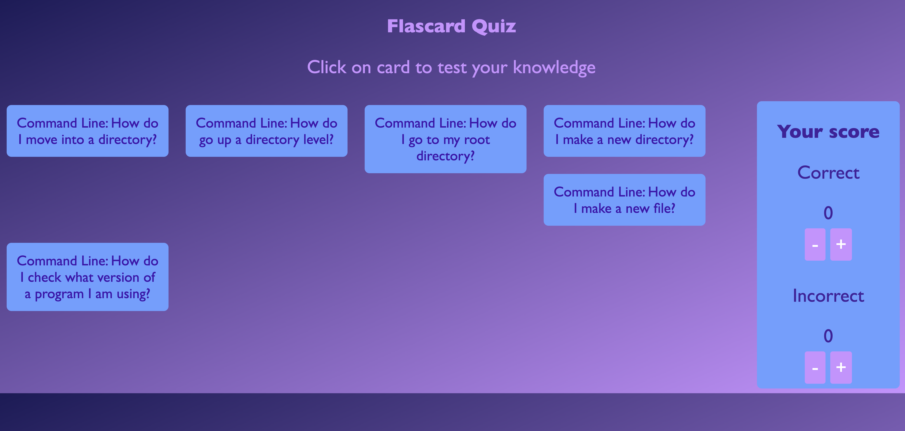

# Quiz (Game)

This is a quiz designed to test your knowledge of the command line interface, developed using React and features flip cards to present questions and answers. The project serves as a practice exercise for implementing components, props, and state in React. It includes a counter that utilizes the useState hook to update the score on the screen. By playing this game, you can not only enhance your CLI knowledge but also reinforce your understanding of React's core concepts and functionality.



### Installation
To get started with the project, follow these steps:
<br/>

1. Clone the repository to your local machine using the following command:
```
git clone git@github.com:xocaid/techtonica-assignments.git
```
2. Navigate to the project directory:
```
cd Week5_QuizGame
```
3. Run command to download dependencies:
```
npm install
```
4. Open app in the development mode:
```
npm start
```
5. Open [http://localhost:3000](http://localhost:3000) to view it in your browser.

---
### Future Development
 - Implement multi-player functionality to allow multiple users to play the game simultaneously.
 - Add a leaderboard or scoring system to track and display the highest scores achieved by players.
 - Create a database to store the questions, answers, and different topics for the quiz.
 - Randomize the order of questions each time the game is played to increase variety and challenge.
 - Enhance the quiz by adding multiple-choice options for each question and updating the counter automatically based on the user's choices.
 - Enhance the user interface to visually represent wins and losses with interactive elements.
 - Implement a timer feature to add a sense of urgency and challenge to the game.


